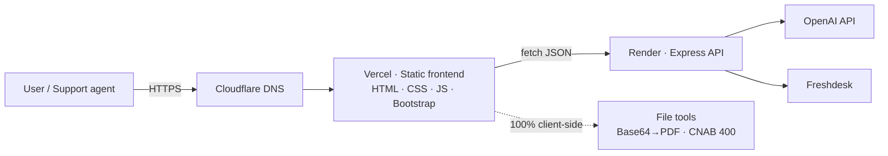

<div align="center">

# Arriba Platform

**An internal tooling hub, knowledge base, and developer portfolio — in one place.**

A production web platform that gives support teams fast, browser-based utilities
(CNAB parsers, data generators, converters), a searchable knowledge base, and
doubles as my personal Full-Stack portfolio.

[**🔗 Live demo → arriba.jm.dev.br**](https://arriba.jm.dev.br/)

<br>


</div>

<!-- Add a real screenshot at docs/preview.png (1280×720 recommended). It is the single
     biggest factor for a recruiter's first impression — do not ship the README without it. -->
<div align="center">
  
</div>

---

## Why this exists

Support teams waste time on repetitive, error-prone manual work: decoding Base64
boletos, reading fixed-width CNAB 400 return files, generating test data, and
hunting for internal procedures. **Arriba Platform** turns each of those into a
fast, self-service tool — and keeps the team's manuals and error catalog one search away.

It also serves a second purpose: it's my portfolio. Instead of a static "about me"
page, it's a **real product with real users and real content** — which is a stronger
signal than a to-do app.

## Highlights

- ⚡ **Client-side by design** — file tools (Base64→PDF, CNAB 400) run entirely in the
  browser. Zero server cost, zero cold-start latency, and sensitive customer data
  **never leaves the machine**.
- 🧭 **Oracle Redwood UI** — a warm, minimal, earthy design system with a mega-menu,
  global search, and native dark mode.
- 🗂️ **Single source of truth** — navigation, search index, and design tokens are each
  defined in exactly one place, so adding a tool or changing a color touches one file.
- 🏦 **Domain-accurate parsers** — the CNAB 400 (Bradesco) parser/generator was validated
  byte-by-byte against the official bank layout and real return files.
- 🤖 **AI assistant** — an OpenAI-backed support copilot integrated into the platform.

## Tech stack

| Layer | Technology | Hosting |
|---|---|---|
| **Frontend** | Vanilla HTML/CSS/JavaScript + Bootstrap 5, custom Oracle-inspired design system | Vercel |
| **Backend** | Node.js + Express — pure JSON API (OpenAI + Freshdesk integrations) | Render |
| **Infra / DNS** | Cloudflare (`jm.dev.br`) | Cloudflare |

> No framework on the frontend by choice: the tools are small, must load instantly, and
> ship as static files. Complexity is added only where it earns its place.

## Architecture



Most tools never touch the backend — they process files locally in the browser. The
API is reserved for what genuinely needs a server (the AI copilot and Freshdesk).

## Featured tools

| Tool | What it does |
|---|---|
| **CNAB 400 Bradesco** | Generates test return files and parses/validates real ones into a readable table |
| **Base64 → PDF (Boleto)** | Decodes Base64 (raw, Data URI, or embedded in JSON) into a viewable/downloadable PDF |
| **Massa de Dados** | Generates fictitious test data (valid CPF/CNPJ, names, addresses, emails) |
| **CSV / JSON utilities** | CSV↔JSON conversion, JSON validation, hashing |
| **Support Copilot** | AI assistant over the internal knowledge base |

## Run locally

No build step is required for the frontend.

```bash
# Frontend — clone and serve statically
git clone https://github.com/<your-username>/arriba_platform.git
cd arriba_platform
npx serve .          # or: VS Code "Live Server"  →  http://localhost:5500
```

```bash
# Backend (optional — only for AI/Freshdesk features)
cd arriba-api
npm install
cp .env.example .env # add your OPENAI_API_KEY etc.
npm start
```

## Project structure

```
arriba_platform/
├─ index.html                 # Home (Oracle-style mega-menu + hero + search)
├─ tools/
│  ├─ dados/                  # Base64→PDF, CSV↔JSON, Hash, JSON Validator
│  └─ datacob/                # CNAB 400, Massa de Dados, Support Copilot, ...
├─ pages/                     # about, case-studies, docs, lab
├─ erros/                     # support error catalog
├─ assets/
│  ├─ css/tokens.css          # single source of truth for the design system
│  ├─ js/navigation-v2.js     # menu + search index (data-driven, one place)
│  └─ data/                   # knowledge-base content
└─ README.md
```

## Roadmap

- [ ] Consolidate the 66 internal manuals into a first-class Knowledge Base section
- [ ] Unify the error catalog into a single searchable page
- [ ] Bilingual content (PT/EN)
- [ ] `Ctrl/Cmd + K` global command palette
- [ ] v2 exploration: Astro + MDX + React islands for SEO-friendly tutorials

## About the author

**Jonathan Mesquita** — IT Support Analyst transitioning into Full-Stack development.
I build tools that solve real operational problems, and I treat my non-traditional
background (technical support + hospitality tech) as an edge, not a gap.

> *"Aprender é hackear a si mesmo."*

- 🌐 Portfolio: [arriba.jm.dev.br](https://arriba.jm.dev.br/)
- 💼 LinkedIn: `<your-linkedin>`
- 📧 Email: `<your-email>`

## License

Released under the [MIT License](LICENSE).

---

<div align="center">
<sub>Built with intention — minimal dependencies, real content, honest engineering.</sub>
</div>
