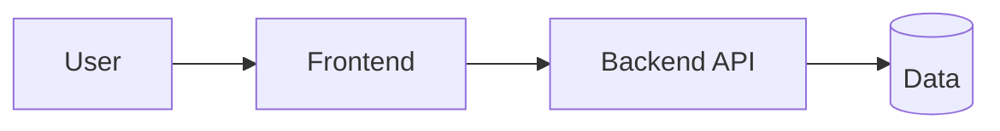

<!--
  ============================================================================
  README TEMPLATE — padrão "chama atenção de recrutador"
  Copie este arquivo para um novo projeto e preencha. Regras de ouro:
  1. As 3 primeiras dobras (título, demo, screenshot) decidem se o recrutador
     continua lendo. Capriche nelas.
  2. Seja HONESTO: só liste o que existe. "Roadmap" é onde vão os planos.
  3. Mostre o PORQUÊ das decisões técnicas — é o que separa júnior de sênior.
  4. Sempre inclua: link do demo AO VIVO + screenshot real + "como rodar".
  Apague estes comentários antes de publicar.
  ============================================================================
-->

<div align="center">

# {Nome do Projeto}

**{Uma frase que diz o que é, em 12 palavras ou menos.}**

{2–3 linhas explicando o valor: que problema resolve e para quem.}

[**🔗 Live demo → {url}**](https://{url})

<br>

<!-- Badges de STACK (shields.io). Use só o que o projeto realmente usa.
     Gere em https://shields.io — estilo flat-square mantém o visual limpo. -->


</div>

<!-- SCREENSHOT: o item de maior impacto. 1280×720, mostrando a tela principal.
     Dica: um GIF curto de uma interação vale mais que uma imagem estática. -->
<div align="center">
  
</div>

---

## Why this exists
<!-- O problema real, em 2–4 frases. Recrutador quer ver que você resolve dor de
     gente de verdade, não que você sabe usar um framework. -->

## Highlights
<!-- 3–6 bullets com BENEFÍCIO + a decisão técnica por trás. Ex: -->
- ⚡ **{benefício}** — {a decisão técnica que o entrega e por quê}.

## Tech stack
| Layer | Technology | Hosting |
|---|---|---|
| Frontend | {…} | {…} |
| Backend | {…} | {…} |
| Infra | {…} | {…} |

> {Uma frase justificando a escolha mais importante — ex.: por que sem framework,
>  por que este banco, por que client-side.}

## Architecture
<!-- Diagrama mermaid renderiza nativo no GitHub. Vale muito visualmente. -->


## Features / How it works
<!-- Tabela ou bullets do que o projeto faz. Concreto, não genérico. -->

## Run locally
```bash
git clone https://github.com/{user}/{repo}.git
cd {repo}
# passos mínimos para rodar
```

## Project structure
```
{repo}/
├─ ...
```

## Roadmap
<!-- Checklist do que vem a seguir. Sinaliza visão de produto. -->
- [ ] {próximo passo}

## About the author
**{Seu nome}** — {uma linha de posicionamento}.
- 🌐 Portfolio: [{url}]({url})
- 💼 LinkedIn: {…}
- 📧 Email: {…}

## License
Released under the [MIT License](LICENSE).
